# 78arm

中文说明: [README.zh-CN.md](README.zh-CN.md)

Delta-arm simulation, calibration tools, servo driver code, sensor tools,
hand-eye vision experiments, and the current real-machine Delta arm controller.

License: GNU GPL v3.0. See [LICENSE](LICENSE). Upstream MIT notices are kept in
[THIRD_PARTY_NOTICES.md](THIRD_PARTY_NOTICES.md).

## STM32MP257 UWB Flight-Control Integration

The current competition system uses the **STM32MP257F-DK as the main onboard
mission controller**. The STM32MP257 side runs ROS 2, MAVROS integration,
UWB AOA parsing, flight-state monitoring, task-state-machine logic, velocity
setpoint generation, and arm/grasp coordination. Jetson Xavier NX is used as a
vision co-processor for AprilTag/YOLO/hand-eye perception, while the flight
controller keeps the attitude, altitude, optical-flow/local-position, and basic
flight-control loops closed.

The STM32MP257/UWB/flight-control workspace from the UAV teammate repository is
merged under:

```text
STM32MP257_UWB_FlightControl/
```

Main ROS 2 packages in that workspace:

- `uwb_driver`: UWB AOA serial parsing, filtering, and topic publishing.
- `uwb_navigation`: indoor no-GPS mission state machine, UWB approach, takeoff,
  hover, return, landing, and bench-test launch files.
- `fcu_bridge`: MAVROS/flight-controller bridge, FCU state monitoring, command
  service, and velocity setpoint forwarding.
- `safety`: failsafe management and safety-check scaffolding.
- `vision_bridge`: Jetson/vision result bridge and coordinate transform hooks.
- `delta_kinematics`: Delta-arm kinematics package for grasp-side integration.

High-level mission chain:

```text
UWB coarse approach
  -> Jetson vision / hand-eye fine localization
  -> STM32MP257 mission decision and command generation
  -> flight-controller attitude/local-position control
  -> Delta arm grasp, return, drop, and landing
```

## UAV Integration Photos

Current integration shots for the UAV-mounted arm and the supporting power and
sensor stack.

| Full platform integration | 45-degree base mount | Power distribution and harness |
| --- | --- | --- |
| 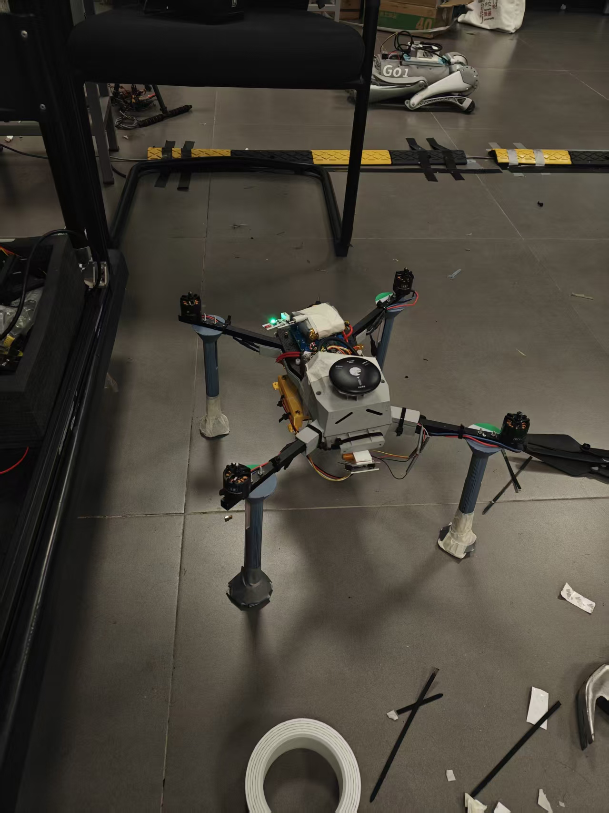<br>Current full-platform integration view. | 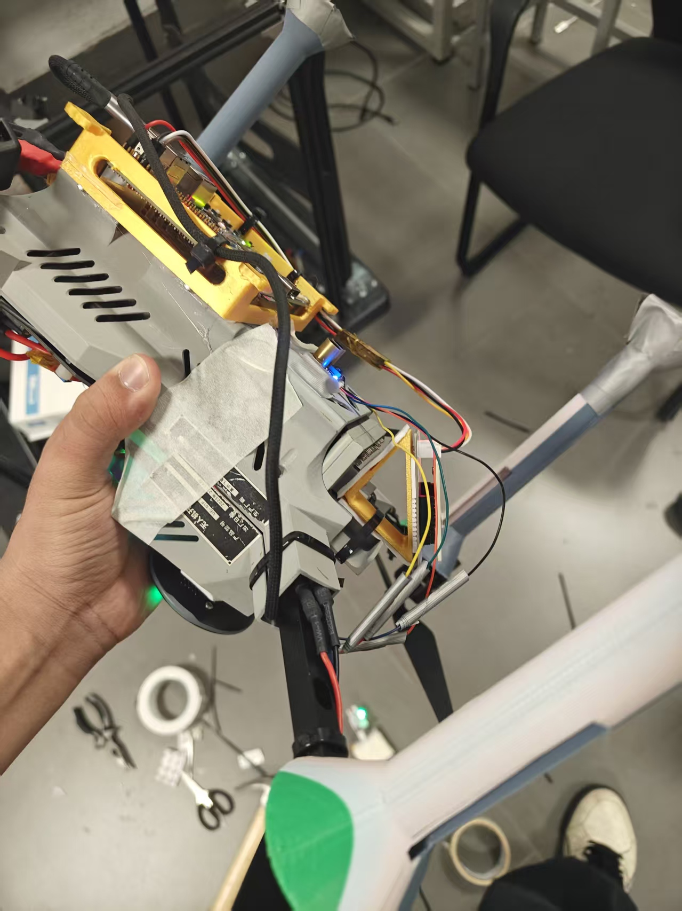<br>Arm mounted at a 45 degree angle on the drone platform. | 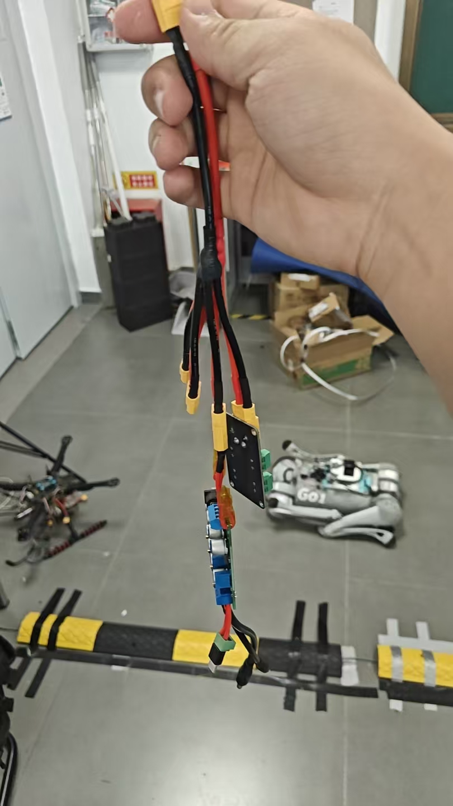<br>Power distribution board and wiring harness during integration. |
| 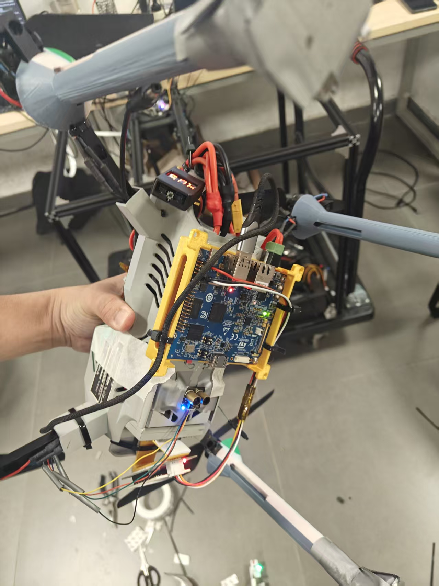<br>Main control stack, sensor wiring, and mounting frame. | <br>UWB beacon module and wiring. |  |

## Second Airframe Photos

| Airframe overview | Assembly progress | Arm and propeller overview |
| --- | --- | --- |
| 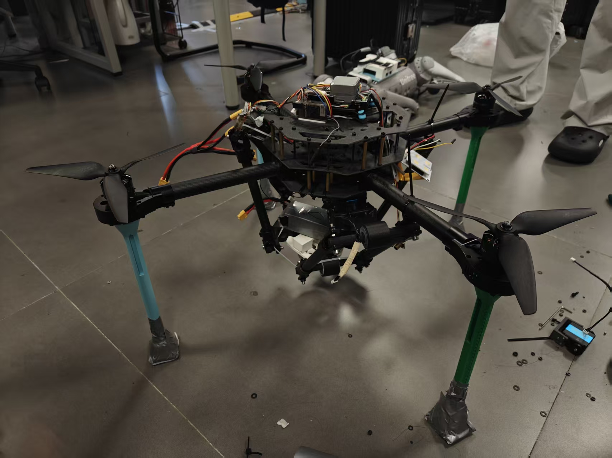<br>Second UAV airframe overview. | 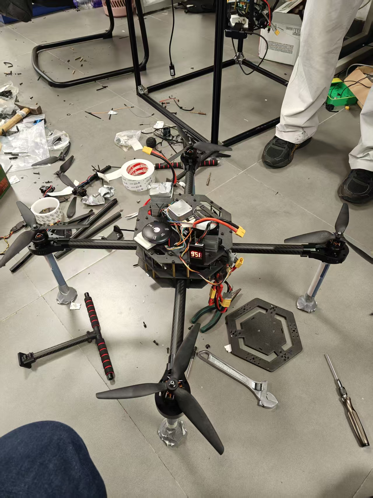<br>Second airframe during assembly. | 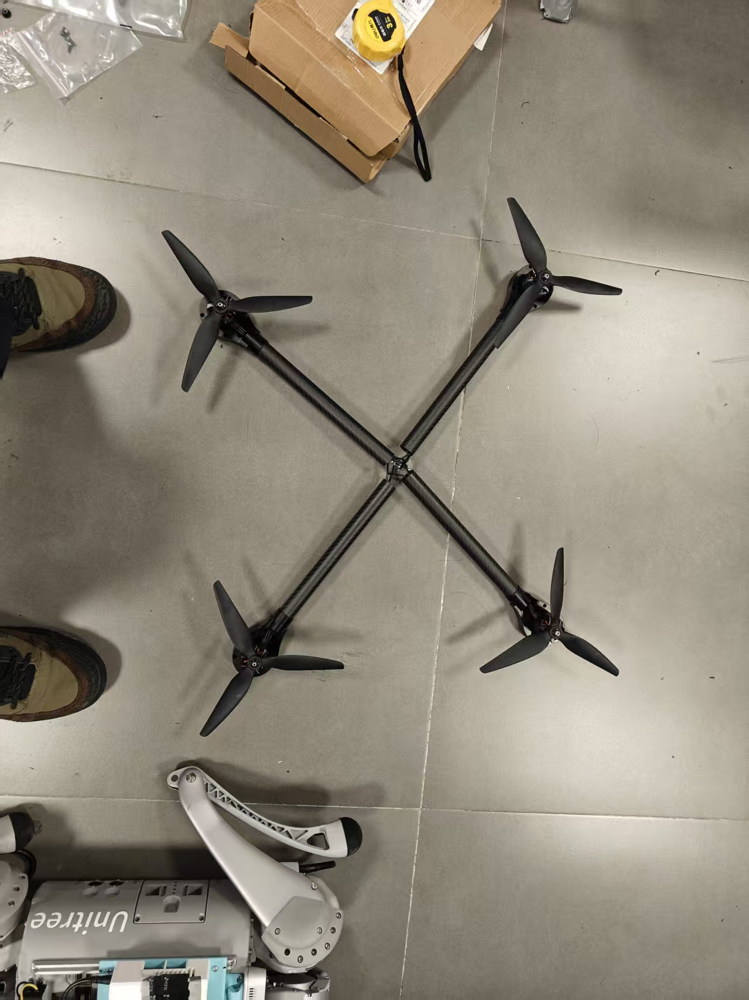<br>Arm and propeller overview. |
| 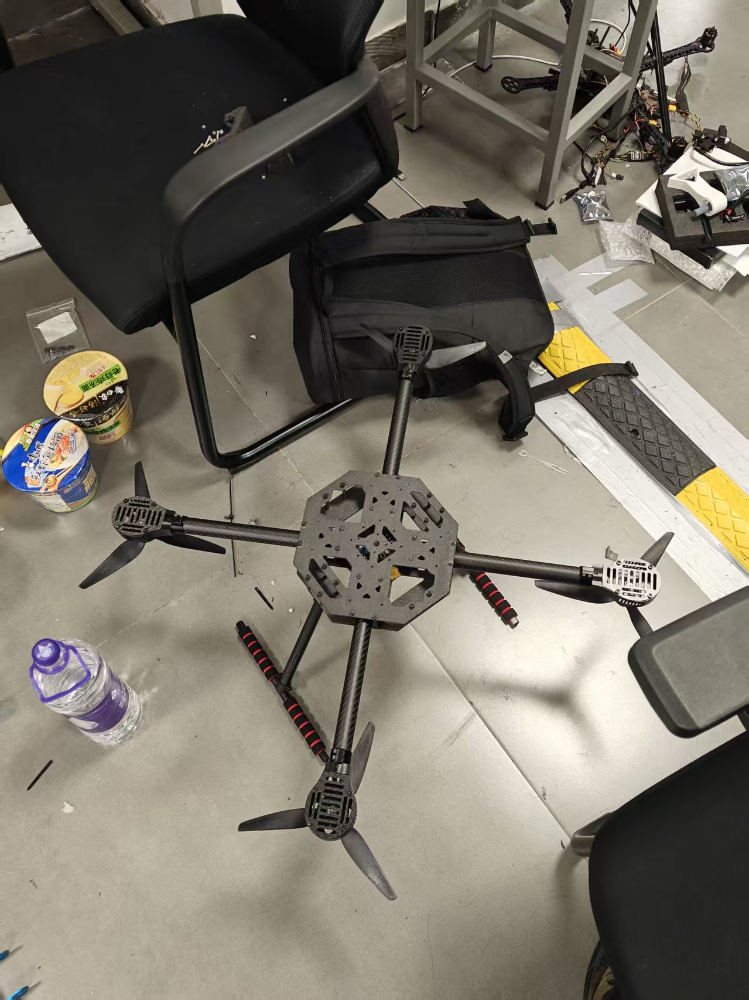<br>Second airframe assembly detail. | 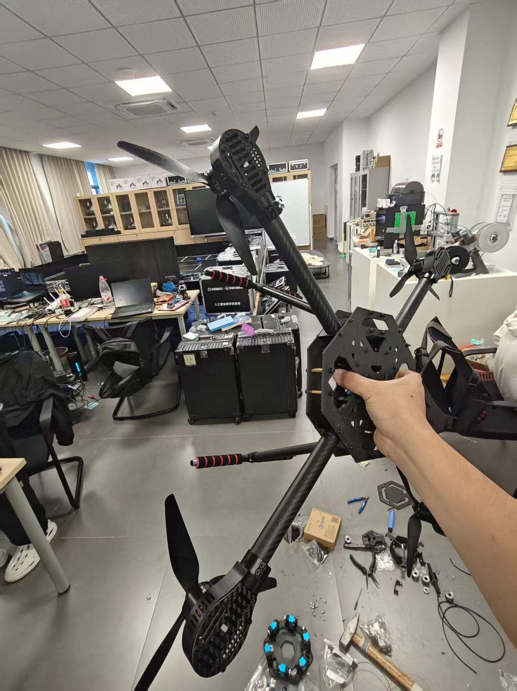<br>Second airframe handling view. |  |

## System Components

| Flight and compute | Vision and arm | Mechanical integration |
| --- | --- | --- |
| 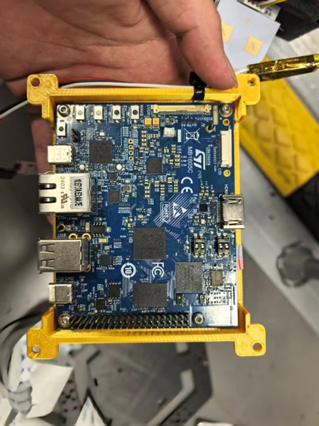<br>STM32MP257 mission-control board. | 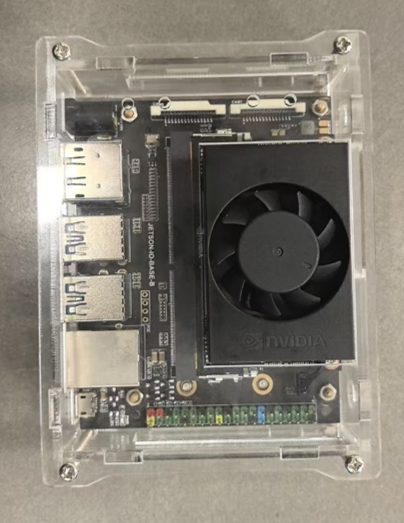<br>Jetson Xavier NX perception and arm computer. | 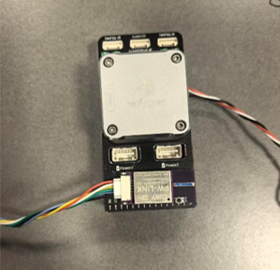<br>CUAV V5 flight controller. |
| 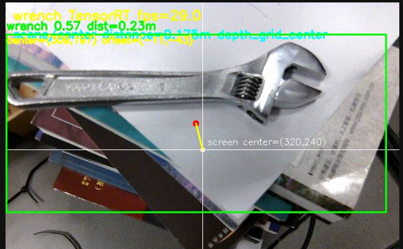<br>Wrench YOLO perception output. | 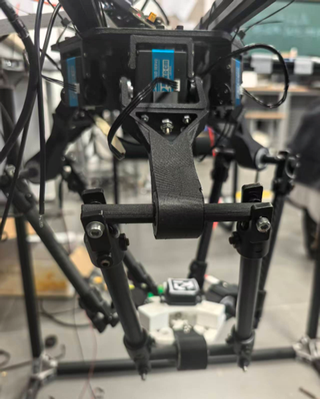<br>Delta-arm integration. | 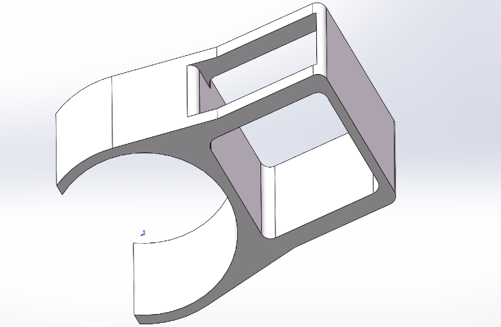<br>Stereo camera mounting hardware. |

Current Jetson field mainline:
`Delta_Gcode_Servo/real_machine_test/jetson_py36/run_sampler_py36_jetson.sh`.
It runs on the Jetson Xavier NX at `192.168.1.174` and combines 3K fisheye
AprilTag detection, 8BitDo low-speed manual motion, servo feedback preflight,
and workspace sampling.

## UAV / STM32MP257 Integration

The imported UAV ROS 2 workspace is maintained in
[`Uav_Delta_capture/`](Uav_Delta_capture/). Its upstream source and fixed
revision are recorded in [`Uav_Delta_capture/UPSTREAM_SOURCE.md`](Uav_Delta_capture/UPSTREAM_SOURCE.md).
This repository owns the NX vision-and-arm integration changes; those changes
must not be pushed to the upstream UAV repository.

The board boundary is strict:

- **STM32MP257:** ROS 2 Humble, UWB, MAVROS, FCU interfaces, mission state
  machine, takeoff/return/landing, and all flight authority.
- **Jetson Xavier NX (`192.168.1.174`):** perception, hand-eye calibration,
  Delta-arm execution, Bluetooth diagnostics, and observation-only reporting.

The NX bridge in [`Uav_Delta_capture/nx_arm_bridge/`](Uav_Delta_capture/nx_arm_bridge/)
sends only validated target/arm observations to the MP257. It never sends FCU,
arming, mode, velocity, waypoint, or landing commands. See
[`MP257_INTERFACE.md`](Uav_Delta_capture/nx_arm_bridge/MP257_INTERFACE.md) for
the protocol and [`docs/README.md`](Uav_Delta_capture/docs/README.md) for the
generated integration report.

NX uses an isolated Python 3.8 environment at
`/home/nvidia/.venvs/78arm-py38`; the legacy Python 3.6 Jetson control path is
kept for existing JetPack 4.4 components and must not be replaced globally.

## Project Context

This repository is for a lightweight delta-arm mounted on or tested for a UAV
platform. The current real-machine control path is not just a gamepad demo:
`Delta_Gcode_Servo/real_machine_test/gamepad_controller.py` reads operator
input, converts it into delta-arm XYZ motion, solves inverse kinematics, maps
joint angles into raw bus-servo positions, and sends those commands through a
Hiwonder xArm 1.6 servo driver board to the physical servos.

The mechanical concept and part of the early delta-robot modeling/control
direction were based on Isaac Chasteau's MIT-licensed
[isaac879/Delta-Robot](https://github.com/isaac879/Delta-Robot). This project
changes the modeling, hardware layout, control code, sensors, and deployment
pipeline, but it still acknowledges that upstream project as the original idea
source.

The 8BitDo compatibility files exist because the Xbox Series wireless
controller was not stable on the Jetson Xavier NX Bluetooth stack used here. In
local testing, that controller repeatedly bounced between connected and
disconnected states. The workaround is to use an 8BitDo Ultimate 2 Wireless
controller and read the Linux input event device directly, without relying on
pygame or SDL mappings.

## Arm Photos and Models

| Prototype frame and electronics | Prototype held for linkage inspection |
| --- | --- |
| 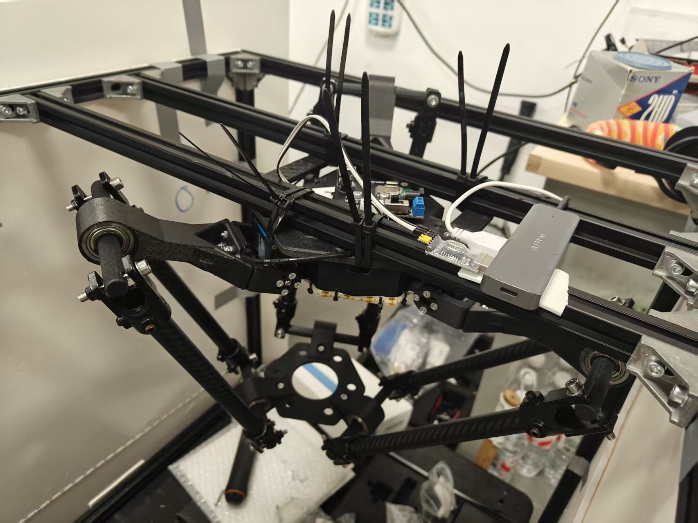<br>Prototype frame, links, control board, and onboard wiring. | 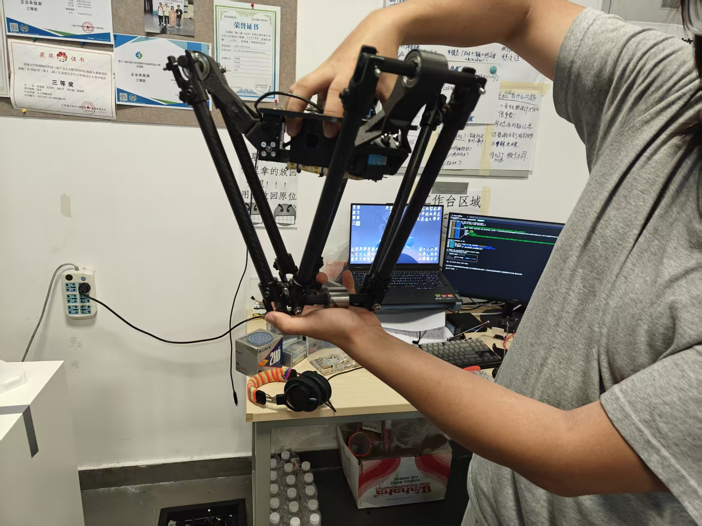<br>Assembled lightweight delta arm during manual inspection. |
| 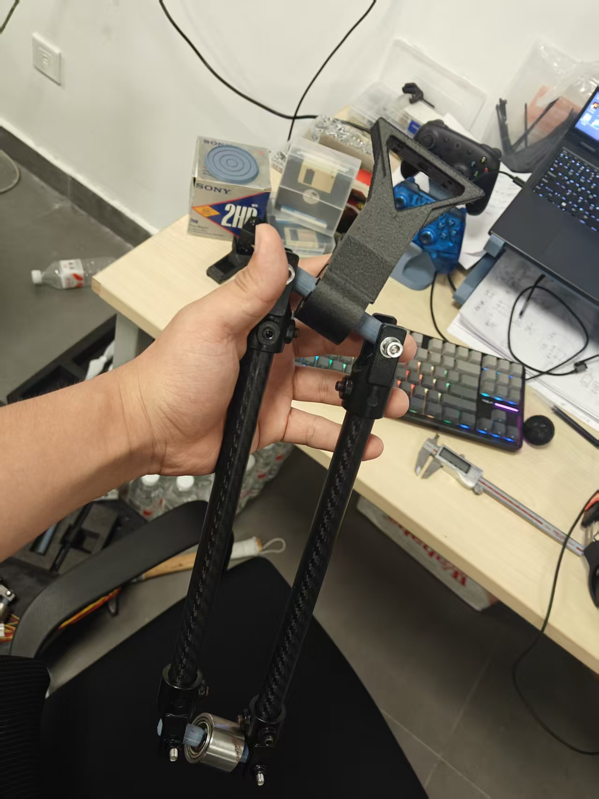<br>Linkage/end-effector side with revised printed part installed. | 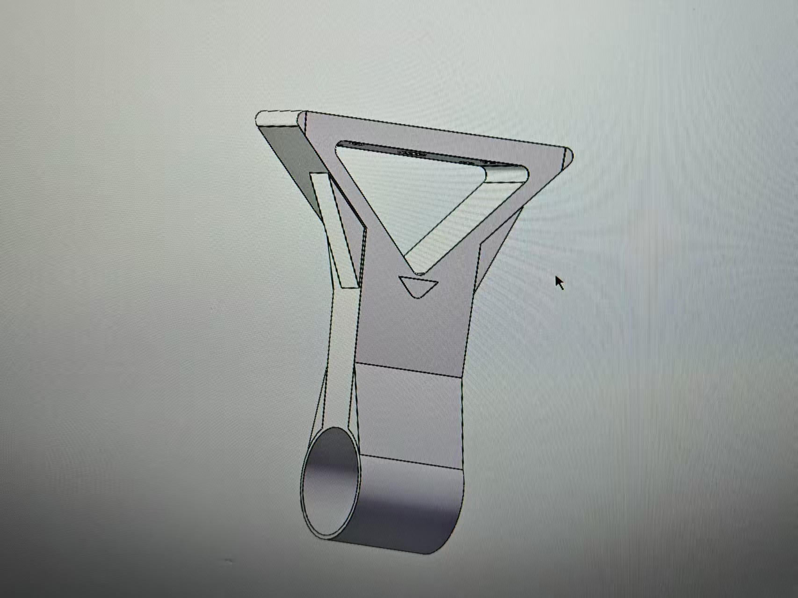<br>Revised CAD concept for a link/mount part. |
| 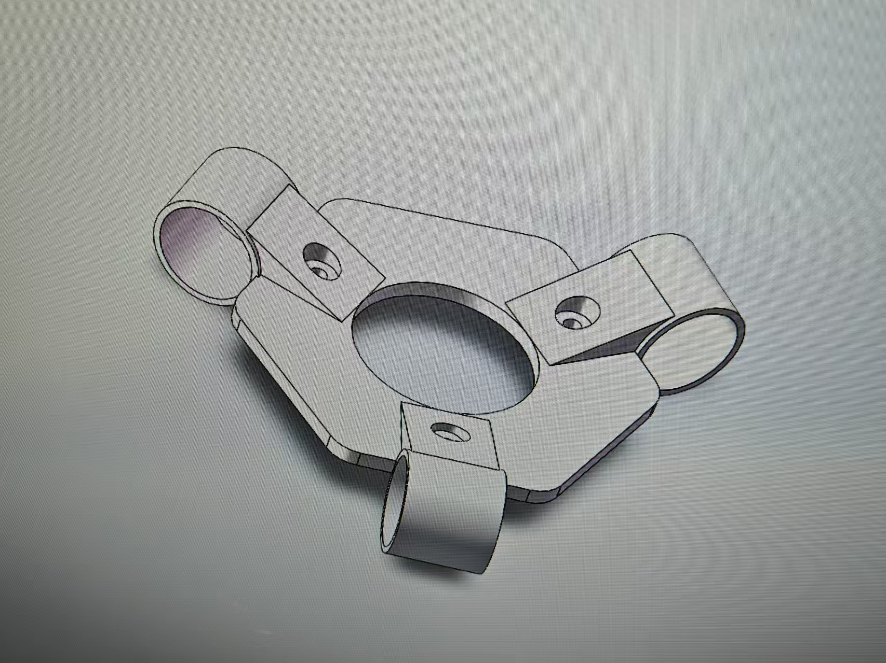<br>Revised end-effector plate and bearing/link mounting geometry. | 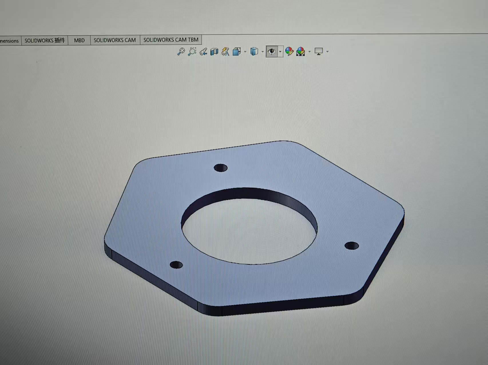<br>Flat plate model suitable for 3D printing or CNC after export. |
| 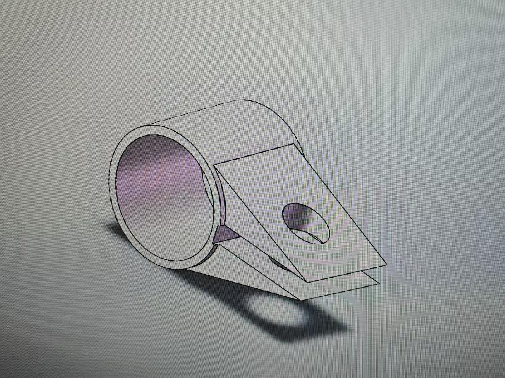<br>Revised single bracket model. | 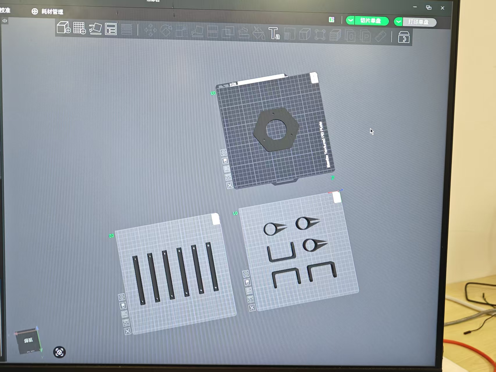<br>3D print slicer layout for revised plates, links, and brackets. |

## Mechanical Model Files

Revised mechanical files are stored in `part_model_rev/`. The folder contains
SolidWorks part files (`.SLDPRT`), a `.3mf` print layout, and the current
`999.STL` mount for fixing the IMU and the end-effector AprilTag. These files
are intended for iteration on the physical arm:

- Use the `.3mf` file as a direct 3D-print starting point.
- Use `999.STL` for the current IMU + top-side AprilTag fixture that supports
  the dual-camera hand-eye workflow.
- Use the `.SLDPRT` files for CAD edits and dimensional changes.
- Export STL/3MF for printing, or export STEP/DXF and generate CAM toolpaths
  for CNC machining where the part geometry is appropriate.
- Check hole diameters, bearing fits, servo clearance, and carbon-tube linkage
  dimensions against the real hardware before printing or machining.

## Current Jetson Sampling Mainline

The actively maintained field path for the current hardware is:

```text
Jetson Xavier NX 192.168.1.80
  -> 3K fisheye full-FOV downsample AprilTag JSON
  -> Delta_Gcode_Servo/real_machine_test/jetson_py36/run_sampler_py36_jetson.sh
  -> read-only preflight: gamepad, AprilTag, servo feedback, startup_check_raw
  -> 8BitDo low-speed manual target XYZ
  -> Delta IK/FK and raw LX bus-servo mapping
  -> Hiwonder xArm 1.6 servo driver board
  -> press B to sample AprilTag XYZ + servo raw for model fitting
```

Offline model fitting and workspace scanning are handled by:

```text
Delta_Gcode_Servo/real_machine_test/workspace_model_tools.py
```

The older `Delta_Gcode_Servo/real_machine_test/gamepad_controller.py` remains in
the repository as the previous local-controller implementation, but it is not
the preferred path for the `192.168.1.80` Jetson Xavier NX sampling workflow.

## Hardware Control Path

```text
Gamepad / operator input
  -> Jetson Xavier NX 192.168.1.80
  -> jetson_py36 sampler
  -> XYZ target and inverse kinematics
  -> raw LX bus-servo position commands
  -> USB serial adapter
  -> Hiwonder xArm 1.6 servo driver board
  -> physical LX bus servos
```

The sampler can move real servos after the typed `YES` confirmation. The
preflight path is read-only and checks 8BitDo input, AprilTag JSON freshness,
servo feedback, and whether servo 1/2/3 are near the configured initial
`startup_check_raw` position.

The default startup tolerance is `30 ticks`. If feedback raw is far outside the
configured raw range, preflight and the sampler reject startup. If feedback is
only outside the startup tolerance, the sampler asks for an explicit uppercase
`HOME` confirmation before slowly moving to the configured `home_raw`.

The xArm 1.6 controller-board `0x15` feedback is parsed as signed int16. A
packet value such as `0xFF43` is therefore `-189`, not unsigned `65347`.
`lx225_tool_demo/config/lx225_tool.demo.toml` keeps two related values per main
servo:

- `startup_check_raw`: the read-only startup self-check target.
- `home_raw`: the motion-mapping reference used after the sampler is allowed to
  run.

For the current disassembled servo-only setup, servo 1/2/3 are set to the
measured home feedback `750`, `762`, and `758`. The active raw mapping range for
each main servo is `0..1000`, with `home_raw` and `startup_check_raw` both set
to those measured home values.

## Dual-Camera Hand-Eye Layout

`Dual_Camera_HandEye/` documents the current vision geometry:

- The base camera looks at the AprilTag on the top side of the end effector and
  estimates/checks `base_T_tool`.
- The underside of the end effector carries the grasping mechanism.
- The side camera on the actuator looks at the object to be grasped. Its fixed
  mount is modeled as `tool_T_object_camera`, measured from CAD/assembly rather
  than solved by making it look at a base tag.

The demo reuses existing outputs:

- `AprilTag_Vision/myAprilTag/output/apriltag_latest.json`
- `IMU/wt61c_latest.json`
- `Delta_Gcode_Servo/real_machine_test/gamepad_controller.py` sensor snapshot
  reading path

It does not open the servo serial port or command motion.

## Jetson Vision Deployment Package

`Jetson_Vision_Export/` stores the recovered Jetson vision deployment archive
and its deployment notes. The package is tracked with Git LFS because the
archive is about 250 MB and exceeds normal GitHub file limits.

It includes the application-level vision stack exported from the Jetson SSD:
TensorRT YOLO service files, ONNX/engine model files, Orbbec SDK files, udev
rules, and systemd service units. The package does not contain or install a
kernel, DTB, DTBO, UEFI image, or camera device-tree overlay.

The included README records the tested migration path to `192.168.1.64`
JetPack 4 / Ubuntu 18.04, including TensorRT 7 engine rebuilds for the COCO,
wrench, wrench-public-negative, and snow-king models.

## Main Folders

- `Delta_Gcode_Servo/`: current Jetson sampling entrypoint, workspace fitting
  tools, G-code tools, Delta IK, raw servo mapping, and base-camera-to-tool
  helpers.
- `bt_8bitdo_min/`: minimal compatibility dependency for the Jetson Xavier NX
  sampler. It now keeps only the 8BitDo evdev reader, bus-servo driver,
  gamepad config, and Bluetooth/input permission installer.
- `Jetson_Vision_Export/`: Git LFS tracked Jetson vision deployment archive,
  checksum, installer, and deployment README for the TensorRT/Orbbec vision
  service package.
- `Delta-Robot/`: original delta robot simulation and model resources.
- `part_model_rev/`: revised SolidWorks/3MF mechanical files for printing or
  CNC-oriented manufacturing export, including `999.STL` for the IMU +
  AprilTag fixture.
- `Dual_Camera_HandEye/`: base-camera plus side-object-camera hand-eye
  coordinate-chain demo that reuses existing AprilTag/IMU snapshots.
- `lx225_tool_demo/`: LX-225 bus-servo tool/demo configuration.
- `IMU/`: WT61C IMU tools and latest snapshot output.
- `AprilTag_Vision/`: AprilTag camera detection tools.
- `Bus_Servo/`: bus-servo examples and utilities.

## Jetson Xavier NX Field Steps

Deploy the current package to `192.168.1.80`:

```powershell
cd C:\Users\hanjuncheng\Desktop\78arm
python Delta_Gcode_Servo\real_machine_test\jetson_py36\deploy_to_jetson.py --password nvidia
```

Install 8BitDo input permissions on the Jetson if needed:

```bash
ssh nvidia@192.168.1.80
cd ~/Desktop/78arm/bt_8bitdo_min
bash deploy/install_ubuntu18.sh
```

Identify the current serial ports before running the preflight. This procedure
only opens serial ports for passive reads and never writes bytes to the servo
driver board.

```bash
ls -l /dev/serial/by-id /dev/serial/by-path 2>/dev/null || true
ls -l /dev/ttyUSB* /dev/ttyACM* 2>/dev/null || true

for p in /dev/ttyUSB* /dev/ttyACM*; do
  [ -e "$p" ] || continue
  echo "[$p]"
  udevadm info --query=property --name="$p" 2>/dev/null \
    | grep -E '^(DEVNAME|ID_BUS|ID_VENDOR|ID_VENDOR_ID|ID_MODEL|ID_MODEL_ID|ID_SERIAL|ID_PATH|ID_USB_DRIVER)=' || true
  fuser -v "$p" 2>/dev/null || true
done
```

Then passively listen at `9600` to find the WT61C IMU. A WT61C stream contains
`0x55 0x51`, `0x55 0x52`, `0x55 0x53`, or `0x55 0x54` frames with valid
checksums. A quiet port during passive listening is expected for the Hiwonder
servo driver board, because it normally responds only after a host query.

```bash
python3 - <<'PY'
import binascii
import os
import select
import time

import serial

ports = ["/dev/ttyUSB0", "/dev/ttyUSB1"]
baudrate = 9600
duration = 5.0


def wt61_frames(buf):
    frames = []
    i = 0
    while i + 11 <= len(buf):
        if buf[i] == 0x55 and buf[i + 1] in (0x51, 0x52, 0x53, 0x54, 0x59):
            frame = buf[i : i + 11]
            frames.append(((sum(frame[:10]) & 0xFF) == frame[10], bytes(frame)))
            i += 11
        else:
            i += 1
    return frames


serials = []
for port in ports:
    if not os.path.exists(port):
        continue
    ser = serial.Serial(
        port=port,
        baudrate=baudrate,
        timeout=0,
        write_timeout=0,
        xonxoff=False,
        rtscts=False,
        dsrdtr=False,
    )
    ser.dtr = False
    ser.rts = False
    serials.append(ser)
    print("%s opened for passive read @ %d" % (port, baudrate))

buffers = {ser.port: bytearray() for ser in serials}
counts = {ser.port: 0 for ser in serials}
end = time.time() + duration

while serials and time.time() < end:
    readable, _, _ = select.select(serials, [], [], 0.2)
    for ser in readable:
        data = ser.read(4096)
        counts[ser.port] += len(data)
        if len(buffers[ser.port]) < 256:
            buffers[ser.port].extend(data[: 256 - len(buffers[ser.port])])

for ser in serials:
    ser.close()

for port in ports:
    buf = buffers.get(port, bytearray())
    frames = wt61_frames(buf)
    ok = sum(1 for valid, _ in frames if valid)
    print("%s bytes=%d wt61_frames=%d checksum_ok=%d" % (
        port,
        counts.get(port, 0),
        len(frames),
        ok,
    ))
    if buf:
        print("  sample_hex=%s" % binascii.hexlify(bytes(buf)).decode("ascii"))
PY
```

On the current `192.168.1.80` Jetson wiring, the observed mapping was:

```text
IMU:    /dev/ttyUSB1 @ 9600
Servo:  /dev/ttyUSB0 @ 9600
```

Prefer the stable `by-path` links when the USB order matters:

```text
IMU:    /dev/serial/by-path/platform-3610000.xhci-usb-0:2.4.1:1.0-port0
Servo:  /dev/serial/by-path/platform-3610000.xhci-usb-0:2.4.2:1.0-port0
```

## Workspace Calibration Flow / 工作空间标定流程

This is the current `192.168.1.80` mainline: run the read-only preflight, collect
low-speed AprilTag plus servo raw samples, then fit the workspace model and scan
the reachable workspace. The script-specific field guide is:

```text
Delta_Gcode_Servo/real_machine_test/jetson_py36/README.md
```

Run the read-only preflight:

```bash
cd ~/Desktop/78arm/Delta_Gcode_Servo/real_machine_test/jetson_py36
python3 jetson_workspace_preflight.py --port /dev/ttyUSB0 --hand-tag-id 3
```

Run the sampler:

```bash
HAND_TAG_ID=3 bash run_sampler_py36_jetson.sh
```

The sampler writes `samples.csv` and `samples.jsonl` under:

```text
Delta_Gcode_Servo/real_machine_test/jetson_py36/samples/YYYYMMDD_HHMMSS/
```

## Wrench Grasp Demo / Jetson Mainline

The current control-side grasp demo lives in the Python 3.6 Jetson mainline:

```text
Delta_Gcode_Servo/real_machine_test/jetson_py36/jetson_wrench_grasp_demo_py36.py
```

It consumes the conservative grasp sequence from:

```text
Dual_Camera_HandEye/output/wrench_grasp_sequence_latest.json
```

Start the fused wrench pose publisher and sequence planner after the RGB/depth
wrench detector is already publishing `http://127.0.0.1:8090/latest.json`:

```bash
cd ~/Desktop/78arm
bash Dual_Camera_HandEye/tools/start_fused_wrench_pose_publisher_jetson.sh
bash Dual_Camera_HandEye/tools/start_wrench_grasp_planner_jetson.sh
```

Check the exact arm waypoints and raw targets without opening the servo serial
port:

```bash
cd ~/Desktop/78arm/Delta_Gcode_Servo/real_machine_test/jetson_py36
python3 jetson_wrench_grasp_demo_py36.py
```

The live execution path keeps the same startup safety pattern as the sampler:
read feedback first, reject out-of-range raw values, require `HOME` if the arm
is not near `startup_check_raw`, then require a typed `GRASP` before sending any
move packet. Servo 4 gripper direction is mechanism-dependent, so use only raw
values that were verified on the real linkage:

```bash
python3 jetson_wrench_grasp_demo_py36.py \
  --execute \
  --port /dev/ttyUSB0 \
  --gripper-mode servo4 \
  --gripper-open-raw <verified_open_raw> \
  --gripper-close-raw <verified_close_raw>
```

For a controller-only smoke test without the vision planner, pass an explicit
target in delta-base millimeters. This still defaults to dry-run unless
`--execute` is present:

```bash
python3 jetson_wrench_grasp_demo_py36.py --target-xyz-mm 0 0 190
```

Fit the workspace model after sampling:

```bash
python3 Delta_Gcode_Servo/real_machine_test/workspace_model_tools.py fit \
  Delta_Gcode_Servo/real_machine_test/jetson_py36/samples/YYYYMMDD_HHMMSS/samples.jsonl \
  --output-dir Delta_Gcode_Servo/real_machine_test/jetson_py36/samples/YYYYMMDD_HHMMSS/model \
  --compute-workspace
```

## License and Attribution

This repository is distributed under the GNU General Public License v3.0. See
[LICENSE](LICENSE).

The upstream delta-robot idea and original reference project came from
[isaac879/Delta-Robot](https://github.com/isaac879/Delta-Robot), which is
MIT-licensed by Isaac Chasteau. The upstream MIT notice is preserved in
[THIRD_PARTY_NOTICES.md](THIRD_PARTY_NOTICES.md). The model files and code in
this repository have been modified for this project's hardware, control stack,
sensors, and manufacturing workflow.
